# Detection is easy, reading order is the tax

### A multilingual benchmark of line detection and reading order on historical documents

Also available as a dataset on Hugging Face: https://huggingface.co/datasets/abhishekjha1008/historical-reading-order-benchmark

Finding the text lines on a historical page is close to solved. Deciding the
*order* in which to read them is not. On a single column the two questions
collapse into one, so the problem stays hidden until the layout has more than one
column. This repository measures exactly that gap: it takes the same historical
pages, across eight languages and roughly four centuries, and asks each
segmentation system two separate questions — **did you find the lines?** and
**did you read them in the right order?**

## The headline

Five systems, 40 pages, eight languages, scored on real ground truth. Detection F
is line-detection at IoU ≥ 0.5; reading-order τ is the Kendall correlation
between the predicted order and the ground-truth document order, measured **only
on the lines a system actually detected**.

| System | Detection F | Reading-order τ | Speed (s/page) |
|--------|:---:|:---:|:---:|
| **kraken** `blla` | 0.91 | **0.98** | 10.6 |
| **YOLOv8m** detector | 0.91 | 0.77 | **1.2** |
| Surya | 0.78 | 0.77 | 5.0 |
| docTR | 0.60 | 0.81 | 5.3 |
| Tesseract | 0.59 | 0.98 | 3.1 |

Read it across, not down. **kraken and the YOLO box-detector tie on detection
(F 0.91).** They diverge only on reading order — and that divergence lives
entirely on the multi-column pages.

## Where the tax is paid

| Language (layout) | kraken τ | YOLO τ | Surya τ |
|-------------------|:---:|:---:|:---:|
| English (2-column print) | **0.97** | **0.50** | 0.50 |
| Swedish (handwritten court record) | **1.00** | **0.47** | 0.49 |
| Middle-French (dense manuscript) | **1.00** | **0.52** | 0.56 |
| — single-column languages (Spanish, Italian, French, Catalan, Franco-provençal) | ≈1.0 | ≈1.0 | ≈1.0 |

On multi-column pages both systems detect lines almost perfectly, yet the fast
box-detector's top-to-bottom order collapses to τ ≈ 0.5 — close to random —
while the layout-aware segmenter's native order holds near 1.0. On single-column
pages the ordering question disappears and everyone scores ≈ 1.0. **The lines
were never the problem. The order was.**

## The picture

The same two-column English page, ordered by each system. Green boxes are
detected lines; the red path is the reading order it would hand to a recogniser.

| Fast box detector (top-to-bottom) | Layout-aware segmenter (native order) |
|:---:|:---:|
| 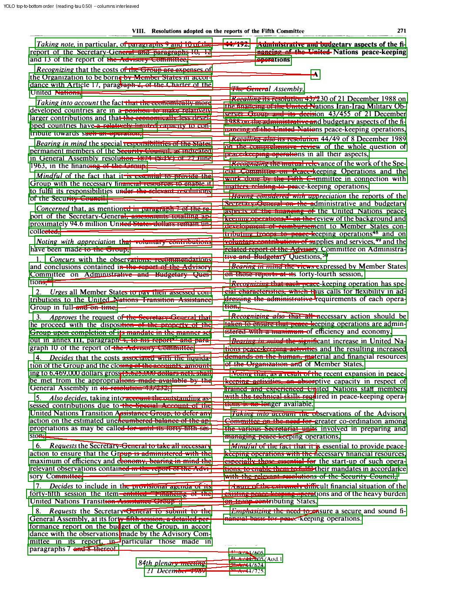 | 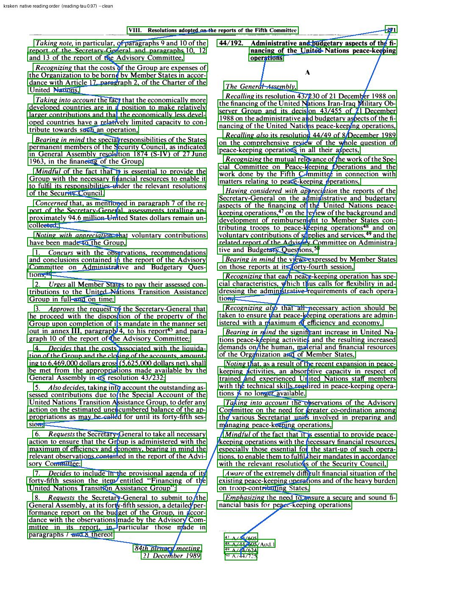 |
| reading order τ = 0.50 | reading order τ = 0.97 |

And the same effect on a ~17th-century Swedish handwritten court record, three
centuries and one script away — the tax is **era-invariant**:

| Fast box detector | Layout-aware segmenter |
|:---:|:---:|
| 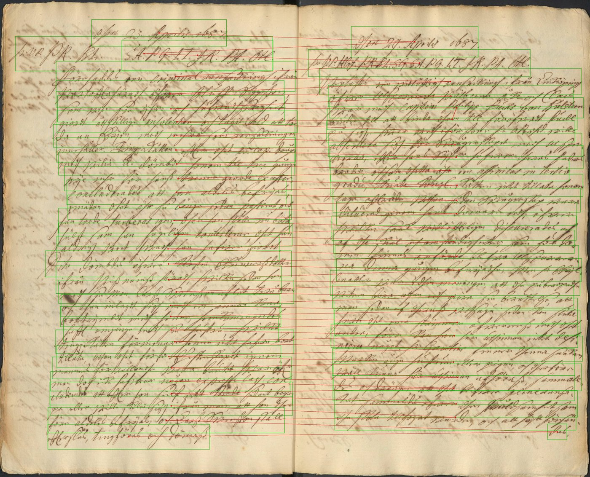 | 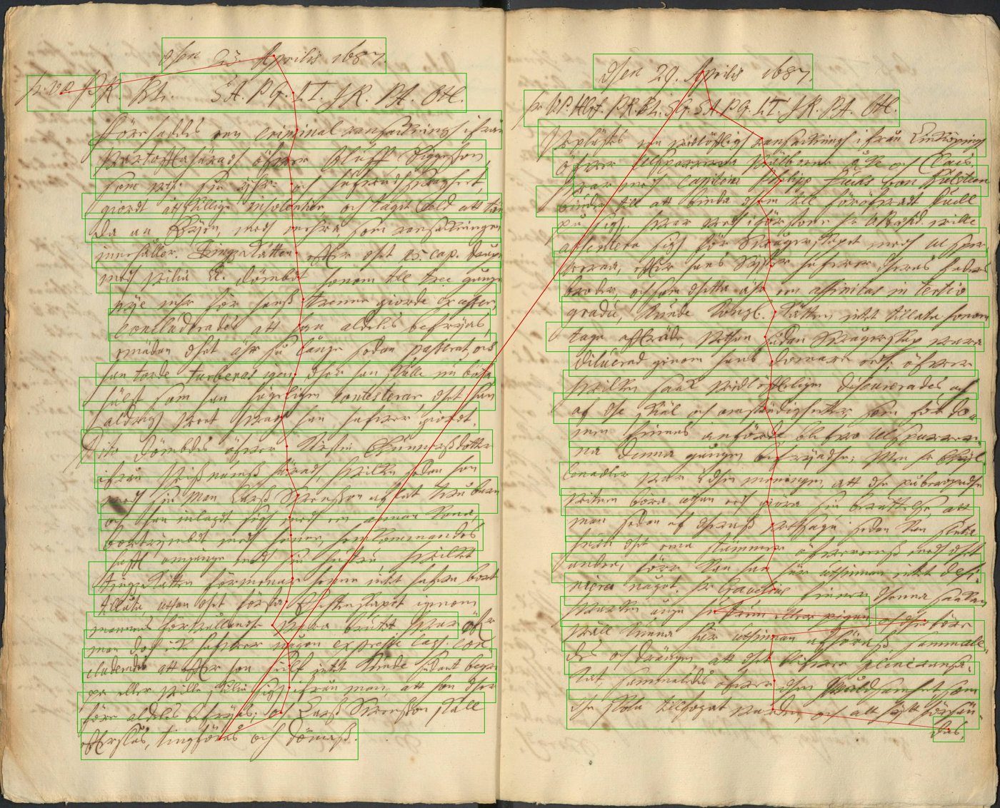 |
| reading order τ = 0.47 | reading order τ = 1.00 |

Fed to a recogniser in the left sequence, a clean transcription of every
individual line still produces scrambled text, because the lines arrive
interleaved between the columns.

## The pages

Every language in the set, one page each. The point of the spread is that it
crosses layout (single vs multi-column), medium (print vs manuscript) and roughly
four centuries — so any effect that survives is not an artefact of one source.

| | | |
|:---:|:---:|:---:|
| 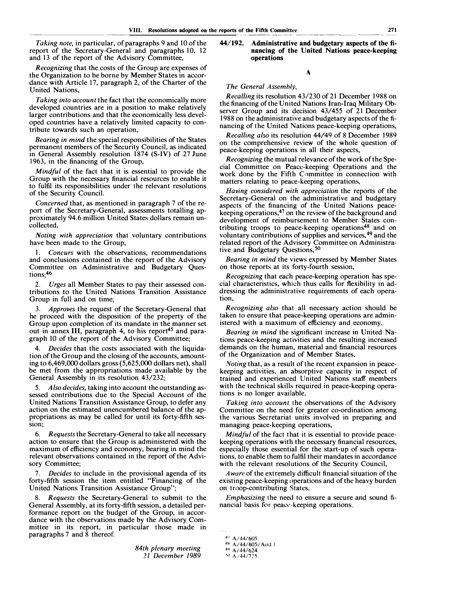 | 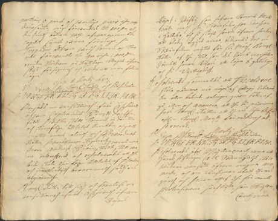 | 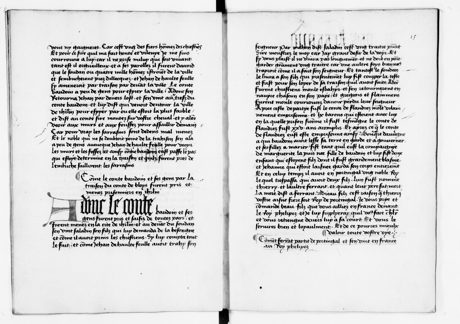 |
| **English** · 20th c. print · 2-column | **Swedish** · ~17th c. court hand · multi-column | **Middle-French** · manuscript · dense |
| 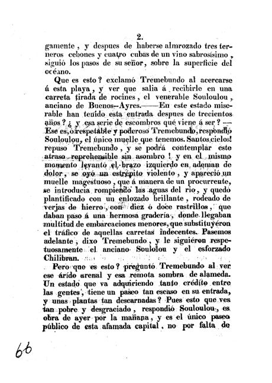 | 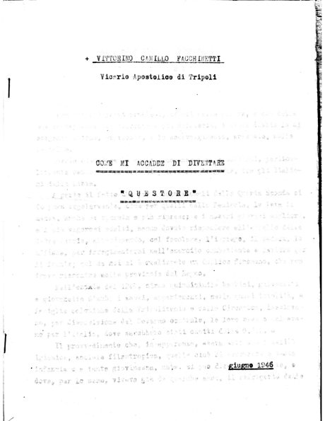 | 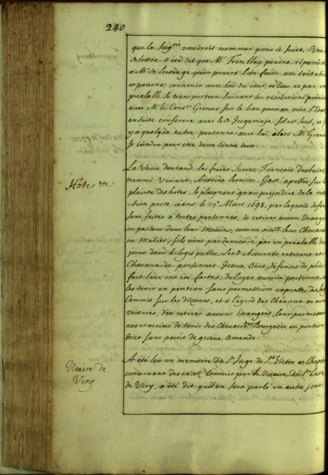 |
| **Spanish** · 19th c. print · 1-column | **Italian** · 20th c. print · 1-column | **French** · 18th c. manuscript · 1-column |
| 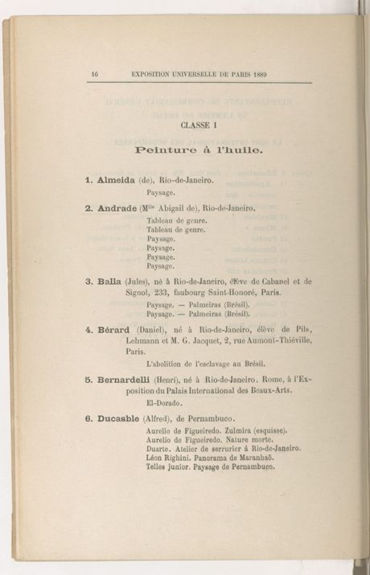 | 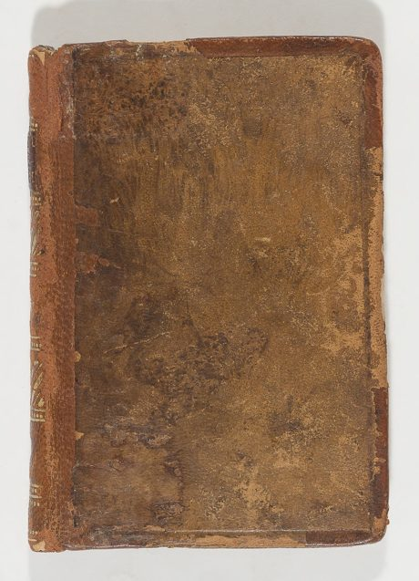 | 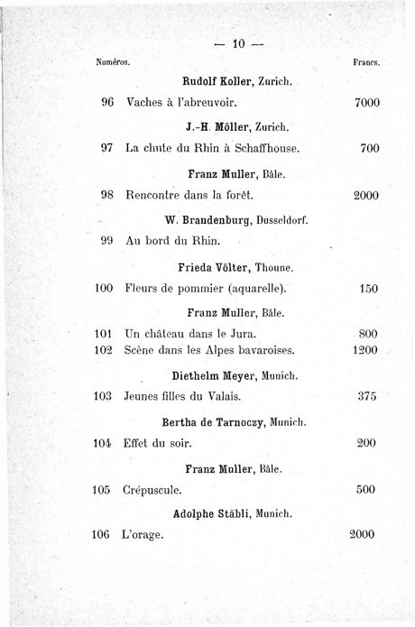 |
| **Catalan** · 19th c. · 1-column | **Franco-provençal** · manuscript · 1-column | **German** · *excluded from scoring (GT under-annotated)* |

The three multi-column / complex pages (English, Swedish, Middle-French) are the
ones where reading order is contested. The single-column pages are the control.
Provenance and licence for each is in [`data_note/SOURCES.md`](data_note/SOURCES.md).

## Why this matters

Most published HTR and OCR numbers report Character Error Rate on lines that were
already cut and ordered correctly. That hides where a large part of real-world
error comes from. When a page has columns, marginalia, or tables, the ordering
step decides whether the downstream transcription is usable at all, and it is
rarely measured on its own. This benchmark separates the two so the ordering cost
becomes visible and comparable across systems, languages and eras.

## Honesty notes

This is a small, deliberately careful pilot, and it is easier to trust because of
what it refuses to claim:

- **Reading order is only scored where detection succeeded.** τ is reported for a
  page only if the system matched ≥ 60 % of GT lines and ≥ 15 lines; otherwise
  the cell reads *det-fail*. Scoring order on three matched lines is meaningless,
  so it is not done. Full per-page matched counts are in `RESULTS.md`.
- **Print-oriented recognisers fail to detect historical handwriting.** Tesseract
  and docTR order printed pages well, but on the Swedish court hand they matched
  27 % / 0 % of lines. Their good overall order numbers come from the easy
  printed pages, not the hard manuscripts — so they are reported as *det-fail* on
  handwriting rather than credited with a perfect order on a handful of lines.
- **German is excluded from scoring.** Its ground truth is under-annotated (every
  system detects far more lines than the GT lists), so its numbers are not
  comparable. Flagged in `data_note/SOURCES.md`, not silently averaged in.
- **No private material.** Only openly licensed FONDUE / HTR-United and public
  Riksarkivet data. Provenance and era per language are in `data_note/SOURCES.md`.

## Systems

| System | Family | Reading order |
|--------|--------|---------------|
| kraken `blla` | baseline + region segmentation | native |
| YOLOv8m line detector | box detection, domain-adapted for historical hands | none (top-to-bottom here) |
| Surya | detection model | none (top-to-bottom here) |
| docTR (DBNet) | detection + recognition | native |
| Tesseract | layout analysis + OCR | layout-aware |

The YOLO detector is the runnable model from
[danish-htr-line-segmenter](https://github.com/AbhiPandit1/danish-htr-line-segmenter);
kraken uses its default `blla` segmentation model.

## Methods — exactly how each system was run

Every system is given the same page image and must return a list of line boxes
**in the order it would read them**. That returned order is what reading-order τ
scores. No per-system tuning; each is run at its documented default.

- **kraken `blla`** (`harness/run_kraken.py`). The `blla` neural baseline +
  region segmenter via `kraken.blla.segment`, using its default model. kraken
  returns lines already in a computed reading order (region-aware, following
  baseline geometry) — that native order is kept as-is, nothing is re-sorted.
- **YOLOv8m line detector** (`harness/run_yolo.py`). The domain-adapted historical
  line-detector, run through `ultralytics` at conf 0.25. A pure box detector has
  **no** notion of order, so the boxes are sorted **top-to-bottom by y1** — the
  naive heuristic almost everyone reaches for. This is deliberately the weakest
  ordering, to show what a detector alone gives you.
- **Surya** (`harness/run_surya.py`). `surya.detection.DetectionPredictor` for
  line boxes; like YOLO it is a detector, so its output is also ordered
  top-to-bottom. (Surya's newer layout module needs a llama.cpp backend and
  returned only coarse region blocks, so the detection module is used for lines.)
- **docTR** (`harness/run_doctr.py`). Mindee docTR with the DBNet detector inside
  `ocr_predictor`; lines are taken in docTR's own block/line traversal order
  (its native reading order), not re-sorted.
- **Tesseract** (`harness/run_tesseract.py`). `pytesseract.image_to_data`; words
  are grouped into lines by Tesseract's `block_num / par_num / line_num`, and
  those groups are kept in Tesseract's own layout-analysis order — which is
  column-aware, hence its strong τ on the pages where it detects at all.

So two families: **detectors** (YOLO, Surya) that only find lines and are ordered
by a geometric heuristic here, and **layout-aware** systems (kraken, Tesseract,
docTR) that emit a reading order themselves. The benchmark is precisely a test of
whether that native order beats the heuristic — and where.

## Metrics — how each number is computed

All scoring is in `harness/bench_lib.py`; `score.py` calls it.

1. **Ground truth.** Each page ships an ALTO or PAGE-XML file. `load_gt()` reads
   every `TextLine` — its bounding box (ALTO `HPOS/VPOS/WIDTH/HEIGHT`, or the
   polygon `Coords` in PAGE) and its **position in document order**, which is the
   intended reading sequence.
2. **Matching (which lines were found).** Predicted boxes are matched to GT boxes
   greedily by **IoU ≥ 0.5** (`iou()` + `match()`). A predicted box counts as a
   hit only if it overlaps a GT line by at least half.
3. **Detection F.** Standard precision/recall on those matches →
   F = 2PR/(P+R). Answers *did you find the lines?*
4. **Reading-order τ.** Take only the **matched** lines. Look at the order the
   system put them in, and compare it to their GT document order using
   **Kendall's τ** (`kt()`). τ = 1.0 means every pair is in the right relative
   order; τ ≈ 0.5 means about half the pairs are swapped — what a two-column page
   does to a top-to-bottom sort. Answers *did you read them in the right order?*
5. **Validity guard.** τ is only reported for a page where the system matched
   **≥ 60 % of GT lines and ≥ 15 lines** — otherwise there aren't enough lines
   for an order to mean anything, and the cell reads *det-fail*. This is what
   stops a system that found 3 of 58 lines from claiming a perfect order.
6. **Speed.** Wall-clock per page, recorded per run, on CPU / Apple MPS.

Detection F and reading-order τ are kept **separate on purpose** — the whole
point is that a system can score high on one and low on the other.

## Reproduce

The 40 scored pages (plus the 5 excluded German pages), their ground truth, and
the precomputed predictions are **bundled under `bench/`**, so scoring runs out
of the box with no downloads:

```bash
pip install -r requirements.txt
python download.py --check       # verify the bundled data is complete
python download.py --sources     # print the canonical source of every page
python harness/score.py          # reproduce the tables above, with the validity guard
```

To regenerate predictions from scratch instead of using the bundled ones:

```bash
python harness/run_kraken.py     # -> bench/pred/kraken/*.json
python harness/run_yolo.py       # -> bench/pred/yolo/*.json
python harness/run_surya.py      # -> bench/pred/surya/*.json
python harness/run_doctr.py      # -> bench/pred/doctr/*.json
python harness/run_tesseract.py  # -> bench/pred/tesseract/*.json
```

`manifest.json` lists every page with its language, era, layout, ground-truth
line count and canonical source; `download.py --sources` reads it.

`harness/gen_multicol_v2.py` also generates synthetic ruled-table pages with
exact line and column labels, used in an ablation on whether synthetic realism
lets a box detector recover column structure.

## Roadmap

- More systems: Transkribus, PaddleOCR PP-Structure, eynollah.
- Datasets with explicit region and reading-order ground truth (DIVA-HisDB, cBAD).
- A geometric ordering stage (XY-cut / column clustering) on top of the fast
  detector, measured against native ordering — the two-tier recommendation the
  numbers already point to.

## Status

An early, honest pilot: five systems, 40 pages, eight languages and roughly four
centuries, a reproducible harness, and one clearly measured effect that survives
its own caveats. Intended to grow into a fuller multi-system study, aimed at the
ICDAR HiP workshop.

## Author

Abhishek Jha — [Hugging Face](https://huggingface.co/abhishekjha1008) ·
[GitHub](https://github.com/AbhiPandit1)

Contributions and collaboration are welcome.
